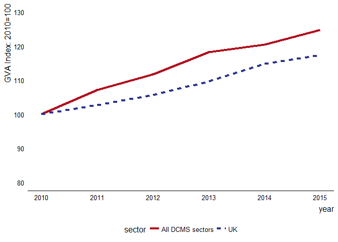

eesectors
=========

Functions for producing the Economic Estimates for DCMS Sectors
---------------------------------------------------------------

First Statistical Release

**This is a prototype and subject to constant development**

This package provides functions used in the creation of a Reproducible
Analytical Pipeline (RAP) for the Economic Estimates for DCMS sectors
publication.

See the
[eesectorsmarkdown](https://github.com/ukgovdatascience/eesectorsmarkdown)
repository for an example of implementing these functions in the context
of a Statistical First Release (SFR).

Installation
------------

The package can then be installed using
`devtools::install_github('ukgovdatascience/eesectors')`. Some users may
not be able to use the `devtools::install_github()` commands as a result
of network security settings. If this is the case, `eesectors` can be
installed by downloading the [zip of the
repository](https://github.com/ukgovdatascience/govstyle/archive/master.zip)
and installing the package locally using
`devtools::install_local(<path to zip file>)`.

Quick start
-----------

This package provides functions to recreate Chapter three -- Gross Value
Added (GVA) of the [Economic estimates of DCMS
Sectors](https://www.gov.uk/government/uploads/system/uploads/attachment_data/file/544103/DCMS_Sectors_Economic_Estimates_-_August_2016.pdf).

### Extracting data from underlying spreadsheets

The data are provided to DCMS as spreadsheets provided by the Office for
National Statistics (ONS). Hence, the first set of functions in the
package are designed to extract the data from these spreadsheets, and
combine the data into a single dataset, ready to be checked, and
converted into tables and figures.

There are four `extract_` functions:

* `extract_ABS_data` 
* `extract_DCMS_sectors` 
* `extract_GVA_data` 
* `extract_SIC91_data` 
* `extract_tourism_data`

------------------------------------------------------------------------

**Note: that with the exception of `extract_DCMS_sectors`, the data
extracted by these functions is potentially disclosive, and should
therefore be handled with care and considered to be OFFICIAL-SENSITIVE.
Steps must be taken to prevent the accidental disclosure of these
data.**

**These should include (but not be limited to):** 

* Not storing the output of these functions in git repositories 
* Labelling of official data with a prefix/suffix of 'OFFICIAL' 
* The use of githooks to search for potentially disclosive files at time of commit and push (e.g.
<https://github.com/ukgovdatascience/dotfiles>) 
* Suitable 2i/QA steps

------------------------------------------------------------------------

The extract functions will return a `data.frame`, and can be called as
follows (see individual function documentation for more information
about each of the arguments).

    # Where working_file.xlsm is the spreadsheet containing the underlying data 

    input <- 'working_file.xlsm' 

    extract_ABS_data(input) 

The various datasets used in the GVA chapter can be combined with the
`combine_GVA()` function, which will return a `data.frame` of the
combined data.

    combine_GVA(
      ABS = extract_ABS_data(input),
      GVA = extract_GVA_data(input),
      SIC91 = extract_SIC91_data(input),
      tourism = extract_tourism_data(input)
    )

### Automated checking

The GVA chapter is built around the `year_sector_data` class. To create
a `year_sector_data` object, a `data.frame` must be passed to it which
contains all the data required to produce the tables and charts in
Chapter three.

An example of how this dataset will need to look is bundled with the
package: `GVA_by_sector_2016`. These data were extracted directly from
the 2016 SFR which is in the public domain, and provide a test case for
evaluating the data.

    library(eesectors) 
    GVA_by_sector_2016 

    ## # A tibble: 54 × 3
    ##      sector  year    GVA
    ##      <fctr> <int>  <dbl>
    ## 1  creative  2010  65188
    ## 2   culture  2010  20291
    ## 3   digital  2010  97303
    ## 4  gambling  2010   8407
    ## 5     sport  2010   7016
    ## 6  telecoms  2010  24738
    ## 7   tourism  2010  49150
    ## 8  creative  2011  69398
    ## 9   culture  2011  20954
    ## 10  digital  2011 102966
    ## # ... with 44 more rows

When an object is instantiated into the `year_sector_data` class, a
number of checks are run on the data passed as the first argument. These
are explained in more detail in the help `?year_sector_data()`

    gva <- year_sector_data(GVA_by_sector_2016) 

    ## Initiating year_sector_data class.
    ## 
    ## 
    ## Expects a data.frame with three columns: sector, year, and measure, where
    ## measure is one of GVA, exports, or enterprises. The data.frame should include
    ## historical data, which is used for checks on the quality of this year's data,
    ## and for producing tables and plots. More information on the format expected by
    ## this class is given by ?year_sector_data().

    ## 
    ## *** Running integrity checks on input dataframe (x):

    ## 
    ## Checking input is properly formatted...

    ## Checking x is a data.frame...

    ## Checking x has correct columns...

    ## Checking x contains a year column...

    ## Checking x contains a sector column...

    ## Checking x does not contain missing values...

    ## Checking for the correct number of rows...

    ## ...passed

    ## 
    ## ***Running statistical checks on input dataframe (x)...
    ## 
    ##   These tests are implemented using the package assertr see:
    ##   https://cran.r-project.org/web/packages/assertr for more details.

    ## Checking years in a sensible range (2000:2020)...

    ## Checking sectors are correct...

    ## Checking for outliers (x_i > median(x) + 3 * mad(x)) in each sector timeseries...

    ## Checking sector timeseries: all_dcms

    ## Checking sector timeseries: creative

    ## Checking sector timeseries: culture

    ## Checking sector timeseries: digital

    ## Checking sector timeseries: gambling

    ## Checking sector timeseries: sport

    ## Checking sector timeseries: telecoms

    ## Checking sector timeseries: tourism

    ## Checking sector timeseries: UK

    ## ...passed

    ## Checking for outliers on a row by row basis using mahalanobis distance...

    ## Checking sector timeseries: all_dcms

    ## Checking sector timeseries: creative

    ## Checking sector timeseries: culture

    ## Checking sector timeseries: digital

    ## Checking sector timeseries: gambling

    ## Checking sector timeseries: sport

    ## Checking sector timeseries: telecoms

    ## Checking sector timeseries: tourism

    ## Checking sector timeseries: UK

    ## ...passed

Any failed checks are raised as warnings, not errors, and so the user is
able to continue. However it is also possible to log these warnings as
github issues by setting `log_issues=TRUE`. This is a prototype feature
that needs additional work to increase the usefulness of these issues,
see below for details on environmental variables that are required for
this functionality to work.

### Creating tables and charts

Tables and charts for Chapter three can be reproduced simply by running
the relevant functions:

    year_sector_table(gva) 

    ## # A tibble: 10 × 10
    ##                 sector  X2010  X2011  X2012  X2013  X2014  X2015
    ##                 <fctr>  <chr>  <chr>  <chr>  <chr>  <chr>  <chr>
    ## 1  Creative Industries   65.2   69.4   73.0   77.9   81.6   87.3
    ## 2      Cultural Sector   20.3   21.0   21.8   23.5   23.5   27.0
    ## 3       Digital Sector   97.3  103.0  105.2  110.0  111.6  118.4
    ## 4             Gambling    8.4    9.3    9.8    9.9   10.2   10.3
    ## 5                Sport    7.0    7.4    7.9    9.8   10.3   10.1
    ## 6             Telecoms   24.7   25.4   26.0   28.0   29.1   30.2
    ## 7              Tourism   49.1   53.9   57.3   59.0   60.4   62.4
    ## 8     All DCMS sectors  177.1  189.8  197.9  209.4  213.3  220.9
    ## 9          % of UK GVA   12.5   13.1   13.2   13.5   13.1   13.3
    ## 10                  UK 1414.6 1452.1 1495.6 1551.6 1624.3 1661.1
    ## # ... with 3 more variables: since_2014 <dbl>, since_2010 <dbl>,
    ## #   UK_perc <dbl>

    figure3.1(gva) 

Note that figures produced remain `ggplot2` objects, and can therefore
be edited in the following way:

    p <- figure3.2(gva)

    p 

Titles, and other layers can then be added simply:

    library(ggplot2)

    p + ggtitle('Figure 3.2: Indexed growth in GVA (2010 =100)\n in DCMS sectors and UK: 2010-2015') 

Note that figures make use of the
[govstyle](https://github.com/ukgovdatascience/govstyle) package. See
the
[vignette](https://github.com/ukgovdatascience/govstyle/blob/master/vignettes/absence_statistics.md)
for more information on how to use this package.

### Logging data issues to github

In order to use this functionality, it is necessary to set the three
following environmental variables:

<table style="width:17%;">
<colgroup>
<col width="5%" />
<col width="5%" />
<col width="5%" />
</colgroup>
<thead>
<tr class="header">
<th>Name</th>
<th>Example</th>
<th>Description</th>
</tr>
</thead>
<tbody>
<tr class="odd">
<td>GITHUB_PAT</td>
<td>_</td>
<td>A github personal access token with the necessary permissions.</td>
</tr>
<tr class="even">
<td>LOG_REPO</td>
<td>RAP-demo-md</td>
<td>The name of a github repository where data issues can be logged.</td>
</tr>
<tr class="odd">
<td>LOG_OWNER</td>
<td>ukgovdatascience</td>
<td>The owner of the repository referred to in LOG_REPO.</td>
</tr>
</tbody>
</table>

Environmental variables can be set interactively using `Sys.setenv()`,
or more permanently by settin gteh variables in an `.Renviron` file
which will be sourced when the project is loading (assuming you are
using projects within Rstudio).
