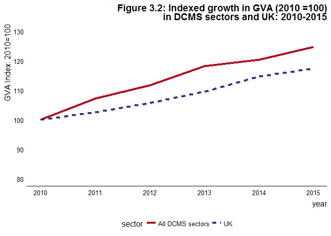

eesectors
=========

Functions for producing the Economic Estimates for DCMS Sectors First Statistical Release
-----------------------------------------------------------------------------------------

**This is a prototype and subject to constant development**

This package provides functions used in the creation of a Reproducible
Analytical Pipeline (RAP) for the Economic Estimates for DCMS sectors
publication.

See the [RAP-demo-md](https://github.com/ukgovdatascience/RAP-demo-md)
repository for an example of implementing these functions in the context
of a Statistical First Release (SFR).

Installation
------------

The package can then be installed using
`devtools::install_github('ukgovdatascience/eesectors')`. Some users may
not be able to use the `devtools::install_github()` commands as a result
of network security settings. If this is the case, `eesectors` can be
installed by downloading the [zip of the
repository](https://github.com/ukgovdatascience/govstyle/archive/master.zip)
and installing the package locally using
devtools::install\_local(<path to zip file>).

Quick start
-----------

This package provides functions to recreate Chapter three of the
[Economic estimates of DCMS
Sectors](https://www.gov.uk/government/uploads/system/uploads/attachment_data/file/544103/DCMS_Sectors_Economic_Estimates_-_August_2016.pdf).

The package is built around the `long_data` class. To create a
`long_data` object, a `data.frame` must be passed to it which contains
all the data required to produce the tables and charts in Chapter three.

An example of how this dataset will need to look is bundled with the
package: `GVA_by_sector_2016`. These data were extracted directly from
the 2016 SFR which is in the public domain, and provide a test case for
evaluating the data.

    library(eesectors)
    GVA_by_sector_2016

    ##                 sector year        GVA
    ## 1  Creative Industries 2010   65188.00
    ## 2      Cultural Sector 2010   20291.00
    ## 3       Digital Sector 2010   97303.00
    ## 4             Gambling 2010    8407.00
    ## 5                Sport 2010    7016.00
    ## 6             Telecoms 2010   24738.00
    ## 7              Tourism 2010   49150.00
    ## 8  Creative Industries 2011   69398.00
    ## 9      Cultural Sector 2011   20954.00
    ## 10      Digital Sector 2011  102966.00
    ## 11            Gambling 2011    9268.00
    ## 12               Sport 2011    7358.00
    ## 13            Telecoms 2011   25436.00
    ## 14             Tourism 2011   53947.00
    ## 15 Creative Industries 2012   73033.00
    ## 16     Cultural Sector 2012   21811.00
    ## 17      Digital Sector 2012  105215.00
    ## 18            Gambling 2012    9800.00
    ## 19               Sport 2012    7901.00
    ## 20            Telecoms 2012   25985.00
    ## 21             Tourism 2012   57343.00
    ## 22 Creative Industries 2013   77885.00
    ## 23     Cultural Sector 2013   23490.00
    ## 24      Digital Sector 2013  110027.00
    ## 25            Gambling 2013    9950.00
    ## 26               Sport 2013    9789.00
    ## 27            Telecoms 2013   27976.00
    ## 28             Tourism 2013   58997.00
    ## 29 Creative Industries 2014   81625.00
    ## 30     Cultural Sector 2014   23453.00
    ## 31      Digital Sector 2014  111559.00
    ## 32            Gambling 2014   10212.00
    ## 33               Sport 2014   10288.00
    ## 34            Telecoms 2014   29095.00
    ## 35             Tourism 2014   60437.57
    ## 36 Creative Industries 2015   87350.00
    ## 37     Cultural Sector 2015   26981.00
    ## 38      Digital Sector 2015  118388.00
    ## 39            Gambling 2015   10300.00
    ## 40               Sport 2015   10133.00
    ## 41            Telecoms 2015   30246.00
    ## 42             Tourism 2015   62406.84
    ## 43                  UK 2010 1414635.00
    ## 44                  UK 2011 1452075.00
    ## 45                  UK 2012 1495576.00
    ## 46                  UK 2013 1551553.00
    ## 47                  UK 2014 1624276.00
    ## 48                  UK 2015 1661081.00
    ## 49         all_sectors 2010  177069.13
    ## 50         all_sectors 2011  189810.66
    ## 51         all_sectors 2012  197915.11
    ## 52         all_sectors 2013  209389.68
    ## 53         all_sectors 2014  213286.79
    ## 54         all_sectors 2015  220928.23

When an object is instantiated into the `long_data` class, a number of
checks are run on the data passed as the first argument. These are
explained in more detail in the help `?long_data()`

    gva <- long_data(GVA_by_sector_2016)

    ## Initiating long_data class.
    ## 
    ## 
    ## Expects a data.frame with three columns: sector, year, and measure, where
    ## measure is one of GVA, exports, or enterprises. The data.frame should include
    ## historical data, which is used for checks on the quality of this year's data,
    ## and for producing tables and plots. More information on the format expected by
    ## this class is given by ?long_data().

    ## 
    ## *** Running integrity checks on input dataframe (x):

    ## 
    ## Checking input is properly formatted...

    ## Checking x is a data.frame...

    ## Checking x has correct columns...

    ## Checking x contains a year column...

    ## Checking x contains a sector column...

    ## Checking x does not contain missing values...

    ## Checking for the correct number of rows...

    ## ...passed

    ## 
    ## ***Running statistical checks on input dataframe (x)...
    ## 
    ##   These tests are implemented using the package assertr see:
    ##   https://cran.r-project.org/web/packages/assertr for more details.

    ## Checking years in a sensible range (2000:2020)...

    ## Checking sectors are correct...

    ## Checking for outliers (x_i > median(x) + 3 * mad(x)) in each sector timeseries...

    ## Checking sector timeseries: all_sectors

    ## Checking sector timeseries: Creative Industries

    ## Checking sector timeseries: Cultural Sector

    ## Checking sector timeseries: Digital Sector

    ## Checking sector timeseries: Gambling

    ## Checking sector timeseries: Sport

    ## Checking sector timeseries: Telecoms

    ## Checking sector timeseries: Tourism

    ## Checking sector timeseries: UK

    ## ...passed

    ## Checking for outliers on a row by row basis using mahalanobis distance...

    ## Checking sector timeseries: all_sectors

    ## Checking sector timeseries: Creative Industries

    ## Checking sector timeseries: Cultural Sector

    ## Checking sector timeseries: Digital Sector

    ## Checking sector timeseries: Gambling

    ## Checking sector timeseries: Sport

    ## Checking sector timeseries: Telecoms

    ## Checking sector timeseries: Tourism

    ## Checking sector timeseries: UK

    ## ...passed

Any failed checks are raised as warnings, not errors, and so the user is
able to continue. However it is also possible to log these warnings as
github issues by setting `log_issues=TRUE`. This is a prototype feature
that needs additional work to increase the usefulness of these issues,
see below for details on environmental variables that are required for
this functionality to work.

### Creating tables and charts

Tables and charts for Chapter three can be reproduced simply by running
the relevant functions:

    format_table(gva)

    ## # A tibble: 10 × 10
    ##                 sector  X2010  X2011  X2012  X2013  X2014  X2015
    ##                 <fctr>  <chr>  <chr>  <chr>  <chr>  <chr>  <chr>
    ## 1  Creative Industries   65.2   69.4   73.0   77.9   81.6   87.3
    ## 2      Cultural Sector   20.3   21.0   21.8   23.5   23.5   27.0
    ## 3       Digital Sector   97.3  103.0  105.2  110.0  111.6  118.4
    ## 4             Gambling    8.4    9.3    9.8    9.9   10.2   10.3
    ## 5                Sport    7.0    7.4    7.9    9.8   10.3   10.1
    ## 6             Telecoms   24.7   25.4   26.0   28.0   29.1   30.2
    ## 7              Tourism   49.1   53.9   57.3   59.0   60.4   62.4
    ## 8          all_sectors  177.1  189.8  197.9  209.4  213.3  220.9
    ## 9           perc_of_UK   12.5   13.1   13.2   13.5   13.1   13.3
    ## 10                  UK 1414.6 1452.1 1495.6 1551.6 1624.3 1661.1
    ## # ... with 3 more variables: since_2014 <dbl>, since_2010 <dbl>,
    ## #   UK_perc <dbl>

    figure3.1(gva)

Note that figures produced remain `ggplot2` objects, and can therefore
be edited in the following way:

    p <- figure3.2(gva)

    p

    library(ggplot2)

    p + 
      ggtitle('Figure 3.2')

Note that figures make use of the
[govstyle](https://github.com/ukgovdatascience/govstyle) package. See
the
[vignette](https://github.com/ukgovdatascience/govstyle/blob/master/vignettes/absence_statistics.md)
for more information on how to use this package.

### Logging data issues to github

In order to use this functionality, it is necessary to set the three
following environmental variables:

<table style="width:17%;">
<colgroup>
<col width="5%" />
<col width="5%" />
<col width="5%" />
</colgroup>
<thead>
<tr class="header">
<th>Name</th>
<th>Example</th>
<th>Description</th>
</tr>
</thead>
<tbody>
<tr class="odd">
<td>GITHUB_PAT</td>
<td>_</td>
<td>A github personal access token with the necessary permissions.</td>
</tr>
<tr class="even">
<td>LOG_REPO</td>
<td>RAP-demo-md</td>
<td>The name of a github repository where data issues can be logged.</td>
</tr>
<tr class="odd">
<td>LOG_OWNER</td>
<td>ukgovdatascience</td>
<td>The owner of the repository referred to in LOG_REPO.</td>
</tr>
</tbody>
</table>

Environmental variables can be set interactively using `Sys.setenv()`,
or more permanently by settin gteh variables in an `.Renviron` file
which will be sourced when the project is loading (assuming you are
using projects within Rstudio).
